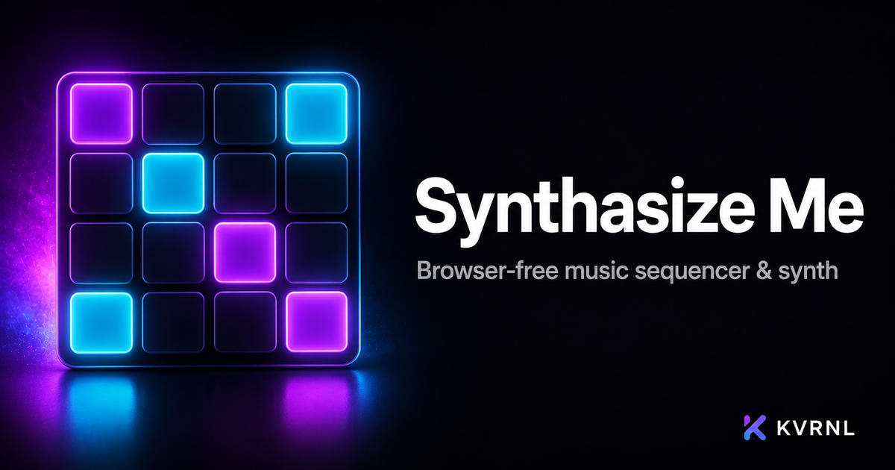

# Synthesize Me

### Browser-free music sequencer & synth

 

A neon step-sequencer, drum machine, and synth in one fast desktop app. Lay down beats, dial in sounds, and jam — no browser tab, all local.

### **[⬇&nbsp; Download Synthesize Me — free at kvrnl.io](https://kvrnl.io/products/synthesize-me/)**

 

---

## What it does

Synthesize Me is a self-contained music studio for your desktop: a step sequencer with a grid you can paint, a drum machine with punchy built-in voices, and a synth for melodies and basslines. Set the tempo, tap it in, hit play, and build a groove in seconds.

Everything runs locally and offline — no browser tab, no cloud, no tracking. Free to use; claim your license key and download it straight from this page.

## Features

- **Step sequencer with a paintable grid**
- **Drum machine — kick, snare, hats, clap & more**
- **Built-in synth for melodies and bass**
- **Tempo control with tap tempo, fully offline**

## Download &amp; install

Synthesize Me is **completely free**. Each install needs its own license key, which you get
with a free KVRNL account.

1. Go to **[kvrnl.io/products/synthesize-me/](https://kvrnl.io/products/synthesize-me/)**
2. Create a free account — email verification, nothing else
3. Claim your license key — instant, no waiting
4. Download and install

> [!NOTE]
> Synthesize Me isn't code-signed yet, so Windows SmartScreen may warn you on first run.
> Click **More info → Run anyway**. Code signing is on the roadmap.

## Your license key

- **Free, one per product**, issued from your KVRNL account.
- **A key activates on one machine.** The first device to activate it claims it.
- **Switching computers?** Hit **Release device** on your
  [account page](https://kvrnl.io/account/) and the key is free to use again.
- Keys are checked over HTTPS at launch. See [Privacy](#privacy).

## Requirements

- **Windows 10 or 11** (64-bit)
- A free [KVRNL account](https://kvrnl.io/signup/) for your license key

## Privacy

Synthesize Me sends KVRNL only what's needed to validate your license: **the key, the
product name, and a hardware ID**. No telemetry, no analytics, no tracking, and
none of your files. Full policy: **[kvrnl.io/privacy](https://kvrnl.io/privacy/)**

## What's new

**v1.0.7** — 2026-09-25
  - New to making music? Synthesize Me now shows you around. A welcome screen on first launch offers a ready-made song, a quick tour, or the freedom to explore. The tour points at each part of the app and explains it in plain English. Press ? anytime for the new Guide, with simple how-tos for beats, sounds, vocals, melodies, songs and saving.
  - Record your voice. Press Rec next to a drum row's sound, count in 3-2-1, and sing, rap or shout up to 6 seconds. Play it back, flip it backwards if you like, and it becomes that row's sound. Tip: start your beat first and wear headphones to sing along.
  - Built-in vocals. Six new vocal sounds for the drum rows, Hey, Yeah, Ah, Oh, Ooh and Huh, plus Choir aah, Choir ooh and Vox lead for the melody tracks.
  - Three new lo-fi packs: Rainy day (soft choir chords), Jazz hop (swung keys and a walking bass) and Sunset tape (warm bells). The original lo-fi pack is now called Lo-fi: Late night.
  - Two blues packs: Blues shuffle, a classic 12-bar shuffle in E with a boogie bassline, and Slow minor blues, a moody 12-bar in A minor with bluesy licks.
  - The style picker is now grouped by genre (Hip-hop & lo-fi, Dance & electronic, Groove & world, Blues), and Reggaeton gained a shouted "Hey!".

**v1.0.6** — 2026-09-25
  - Seven drum kits. One switch swaps all eight drums at once: Classic, 808, 909 House, Lo-fi, Trap, Techno and Acoustic. Each kit has its own character, from warm and clean to crunchy and driven.
  - 36 drum sounds to pick from. Click any row's name to choose its sound, from new kicks, snares, hats and cymbals to cowbell, shaker, conga, bongo, tambourine, woodblock, an 808 boom and FX like risers, impacts, lasers and vinyl crackle. Every row also has Tune and Length controls.
  - Two melody tracks, Lead and Bass, that play at the same time, each with its own sound, octave, length and volume. Thirteen instrument sounds, including sub bass, 808 bass, lead, supersaw, chiptune, pad, keys, pluck and bells.
  - Style starter packs. Press New and pick Boom bap, Trap, House, Techno, Drum & bass, Lo-fi, Reggaeton, Afrobeats or Funk. Each one loads the right kit, tempo, swing, a bassline and three patterns already chained into a song. Undo takes you straight back.
  - Use your own sounds. Drag a WAV or MP3 onto any drum row and it becomes that drum. It's saved with your project and remembered next time you open the app.
  - Groove tools. Right-click any step for its level, hi-hat style rolls of 2, 3 or 4 hits, and a chance setting so the beat varies each time round. On the melody side, a scale lock keeps every note in key and chord mode places a whole chord with one click.
  - Dropping a file anywhere in the window can no longer take you away from the app, and dropping a saved project opens it.

**v1.0.5** — 2026-09-06
  - Brand-new design, top to bottom. Synthesize Me now looks and works like a hardware groovebox: a big play pad, an LED tempo readout with tap tempo, clearly labelled sections, and a sidebar for Song, Effects and Output so nothing important is hidden in a menu. The layout scrolls and resizes cleanly - nothing gets cut off by the window edge any more, on any screen size.
  - Faster to make beats: drag across the grid to paint several steps at once, right-click a step for an accent or a ghost hit, and click any track name or piano key to hear it. Switch between Drums, Melody, or see Both at once.
  - Undo everything. Ctrl+Z steps back through every edit, and Clear, Paste, New and Open all offer a one-click Undo.
  - Your work is remembered. Close the app and reopen it, and your patterns, song chain, tempo and effects are exactly where you left them. Turn this off in Settings if you prefer a clean slate.
  - Song mode is always on screen with a proper chain builder. Export WAV now renders the whole song when song mode is on, and the file includes your reverb, delay and filter, so it sounds like the app.
  - Settings, keyboard shortcuts and About now live in one tidy window. The filter cutoff slider is musically scaled, and Ctrl+C / Ctrl+V / Ctrl+S / Ctrl+O copy, paste, save and open.
  - Fixed: swing slowed the tempo instead of shuffling; song mode played the wrong first hit and skipped the first slot; the melody playhead only moved every four steps; saved projects lost their octave, note length and synth volume; Export and Save could silently do nothing; the reverb decay slider stuttered while dragging; shortcuts stopped working after touching a slider; and a licensing-server outage could lock you out mid-session.

**v1.0.4** — 2026-08-18
  - Downloads and automatic updates now come straight from KVRNL's own servers instead of a third-party host. Updates are quicker and more reliable, and nothing inside the app itself has changed.
  - If you installed this app before today, please download it once more from kvrnl.io. Older copies still look for updates at the old location and can't carry themselves across the move — this one time has to be done by hand.

**v1.0.3** — 2026-08-10
  - The name is now spelled “Synthesize Me” everywhere — the installer, the download link, the update feed and the app itself.

Full history → **[kvrnl.io/changelog/synthesize-me](https://kvrnl.io/changelog/synthesize-me/)**

## Documentation

Setup guides and how-tos → **[kvrnl.io/docs/synthesize-me](https://kvrnl.io/docs/synthesize-me/)**

## Support

> [!IMPORTANT]
> **We don't use GitHub Issues.** Report bugs from inside the app — it's the
> fastest route to us and it attaches the details we need automatically.

- 🐛 **Found a bug?** Use **Report a Problem** inside Synthesize Me
- 💬 **Chat with us** → **[Discord](https://discord.gg/Ub4SdAuhu)**
- ✉️ **Anything else** → **[kvrnl.io/contact](https://kvrnl.io/contact/)**
- ❓ **FAQ** → [kvrnl.io/faq](https://kvrnl.io/faq/)

## License

**Proprietary freeware — free to use, not open source.**

This repository hosts the installer releases, documentation, and license for
Synthesize Me. **The application source code is not published.** See
**[LICENSE](./LICENSE)** for the full terms.

---

 

**[kvrnl.io](https://kvrnl.io)** &nbsp;·&nbsp; **[All products](https://kvrnl.io/products/)** &nbsp;·&nbsp; **[Changelog](https://kvrnl.io/changelog/)** &nbsp;·&nbsp; **[Discord](https://discord.gg/Ub4SdAuhu)** &nbsp;·&nbsp; **[Contact](https://kvrnl.io/contact/)**

© 2026 <b>KVRNL</b> — an AI-powered software studio shipping free desktop tools.

